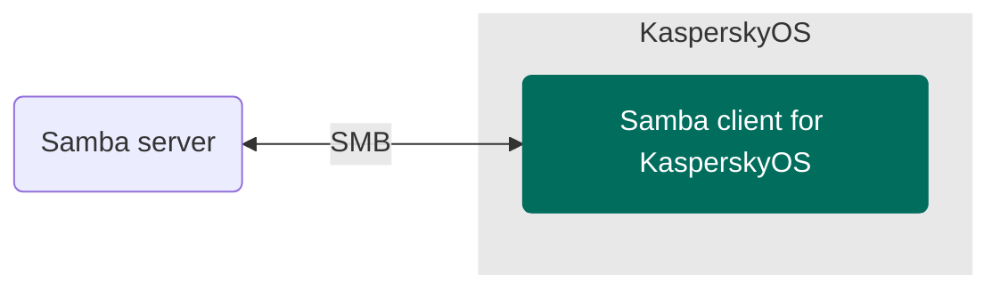

# KasperskyOS Samba client example

> An example of a KasperskyOS-based solution using a Samba client.

## Table of contents
- [KasperskyOS Samba client example](#kasperskyos-samba-client-example)
  - [Table of contents](#table-of-contents)
  - [Solution overview](#solution-overview)
    - [List of programs](#list-of-programs)
    - [Solution scheme](#solution-scheme)
    - [Initialization description](#initialization-description)
    - [Security policy description](#security-policy-description)
  - [Getting started](#getting-started)
    - [Prerequisites](#prerequisites)
    - [Building the example](#building-the-example)
      - [CMake input files](#cmake-input-files)
  - [Usage](#usage)

## Solution overview

### List of programs

* `TestClient`—Program that initializes the network interface `en0` and interacts with the Samba server by calling API methods
* `VfsSdCardFs`—Program that supports SDCardFS file system
* `VfsNet`—Program that is used for working with the network
* `Dhcpcd`—DHCP client implementation program that gets network interface parameters from an external DHCP server in the background and passes them to the virtual file system
* `DCM`—KasperskyOS Native Dynamic Connection Manager
* `SDCard`—Block device driver of the SDCard
* `EntropyEntity`—Random number generator
* `DNetSrv`—Driver for working with network cards
* `GPIO`—GPIO driver (only for Radxa ROCK 3A)
* `BSP`—Board support package driver
* `PinCtrl`—PinCtrl driver (only for Radxa ROCK 3A)
* `Bcm2711MboxArmToVc`—Mailbox driver (only for Raspberry Pi 4 B)

[⬆ Back to Top](#Table-of-contents)

### Solution scheme



[⬆ Back to Top](#Table-of-contents)

### Initialization description

<details><summary>Statically created IPC channels</summary>

* `testclient.TestClient` → `kl.VfsNet`
* `testclient.TestClient` → `kl.VfsSdCardFs`
* `kl.rump.Dhcpcd` → `kl.VfsNet`
* `kl.rump.Dhcpcd` → `kl.VfsSdCardFs`
* `kl.VfsNet` → `kl.EntropyEntity`
* `kl.VfsNet` → `kl.drivers.DNetSrv`
* `kl.VfsSdCardFs` → `kl.drivers.SDCard`
* `kl.VfsSdCardFs` → `kl.EntropyEntity`
* `kl.drivers.SDCard` → `kl.drivers.BSP`
* `kl.drivers.SDCard` → `kl.drivers.GPIO` (only for Radxa ROCK 3A)
* `kl.drivers.DNetSrv` → `kl.drivers.Bcm2711MboxArmToVc` (only for Raspberry Pi 4 B)
* `kl.drivers.BSP` → `kl.drivers.Bcm2711MboxArmToVc` (only for Raspberry Pi 4 B)
* `kl.drivers.GPIO` → `kl.drivers.PinCtrl` (only for Radxa ROCK 3A)

</details>

The [`./einit/src/init.yaml.in`](einit/src/init.yaml.in) template is used to automatically generate a part of the solution initialization description file `init.yaml`. For more information about the `init.yaml.in` template file, see the [KasperskyOS Community Edition Online Help](https://click.kaspersky.com/?hl=en-us&link=online_help&pid=kos&version=1.4&customization=KCE&helpid=cmake_yaml_templates).

[⬆ Back to Top](#Table-of-contents)

### Security policy description

The [`./einit/src/security.psl`](einit/src/security.psl) file contains a solution security policy description. For more information about the `security.psl` file, see [KasperskyOS Community Edition Online Help](https://click.kaspersky.com/?hl=en-us&link=online_help&pid=kos&version=1.4&customization=KCE&helpid=ssp_descr).

[⬆ Back to Top](#Table-of-contents)

## Getting started

### Prerequisites

1. Confirm that your host system meets all the
[System requirements](https://click.kaspersky.com/?hl=en-us&link=online_help&pid=kos&version=1.4&customization=KCE&helpid=system_requirements)
listed in the KasperskyOS Community Edition Developer's Guide.
1. [Install](https://click.kaspersky.com/?hl=en-us&link=online_help&pid=kos&version=1.4&customization=KCE&helpid=sdk_install_and_remove)
the KasperskyOS Community Edition SDK version 1.4. You can download it for free from
[os.kaspersky.com](https://os.kaspersky.com/development/).
1. Copy the source files of this example to your local project directory.
1. Source the SDK setup script to configure the build environment. This exports the `KOSCEDIR`
  environment variable, which points to the SDK installation directory:
   ```sh
   source /opt/KasperskyOS-Community-Edition-<platform>-<version>/common/set_env.sh
   ```
1. [Build the necessary drivers](https://click.kaspersky.com/?hl=en-us&link=online_help&pid=kos&version=1.4&customization=KCE&helpid=building_radxa_drivers)
from source only if you intend to run this example on Radxa ROCK 3A hardware. This step is not
required for QEMU or Raspberry Pi 4 B.

[⬆ Back to Top](#Table-of-contents)

### Building the example

The Samba client for KasperskyOS is built using the CMake build system, which is provided in the KasperskyOS Community Edition SDK.

To build the example to run on QEMU, go to the directory with the example and run the following commands:
```
$ cmake -B build -D CMAKE_TOOLCHAIN_FILE="$KOSCEDIR/toolchain/share/toolchain-aarch64-kos.cmake"
$ cmake --build build --target {kos-qemu-image|sim}
```
where:
* `kos-qemu-image` creates a KasperskyOS-based solution image for QEMU that includes the example;
* `sim` creates a KasperskyOS-based solution image for QEMU that includes the example and runs it.

To build an example to run on a hardware, use the following commands:
```
$ cmake -B build -D CMAKE_TOOLCHAIN_FILE="$KOSCEDIR/toolchain/share/toolchain-aarch64-kos.cmake"
$ cmake --build build --target {kos-image|sd-image}
```
where:
* `kos-image` creates a KasperskyOS-based solution image that includes the example;
* `sd-image` creates a file system image for a bootable SD card.

For more information about running example on a hardware see the following [link](https://click.kaspersky.com/?hl=en-us&link=online_help&pid=kos&version=1.4&customization=KCE&helpid=running_sample_programs_rpi).

[⬆ Back to Top](#Table-of-contents)

#### CMake input files

[./testclient/CMakeLists.txt](testclient/CMakeLists.txt)—CMake commands for building the `TestClient` program.

[./einit/CMakeLists.txt](einit/CMakeLists.txt)—CMake commands for building the `Einit` program and the solution image.

[./CMakeLists.txt](CMakeLists.txt)—CMake commands for building the solution.

[⬆ Back to Top](#Table-of-contents)

## Usage

1. Configure any Samba server available to you:
    * [Create an account](https://www.cyberciti.biz/faq/adding-a-user-to-a-samba-smb-share/) with the username `test` and password `12345678`.
    * Add the following parameters to the `/etc/samba/smb.conf` file:
      ```
      [public]
      path = /home/test
      valid users = test
      writeable = yes
      ```
   If you already have a Samba server configured, you can replace the parameters in the example code [./testclient/main.c](testclient/main.c) with the required parameters.
1. Run the Samba server.
1. To run the example on QEMU, go to the directory with the Samba client example and run the following command:
   ```
   $ cmake --build build --target sim
   ```
   For more information about running example on a hardware see the following [link](https://click.kaspersky.com/?hl=en-us&link=online_help&pid=kos&version=1.4&customization=KCE&helpid=running_sample_programs_rpi).
1. Wait until the program activity report is fully generated in the standard output. The report ends with information about the API methods called by the Samba client and results of executing these methods.

[⬆ Back to Top](#Table-of-contents)
